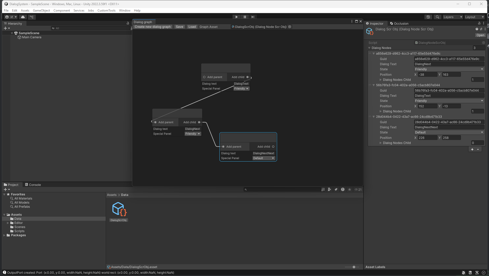

#🧠 Dialog Graph Editor for Unity (GraphView-based)

Editor tool for managing branching dialog systems using Unity’s GraphView API.
Originally designed as an internal tool for a specific project structure, but can be adapted to any dialog system with nodes and connections.

---

📦 Main Features
    Create dialogs through a node graph
    Edit text, state, and links between nodes
    Save/load dialogs into a ScriptableObject
    UI built with UIElements + GraphView
    Easy to extend and integrate

---

## 📂 Структура проекта

| Components | Description |
|----------|----------|
| `DialogGraphEditor.cs` | Main editor window (EditorWindow + Toolbar) |
| `DialogNodeGraph.cs` | Graph base (GraphView + connection logic) |
| `DialogNodeView.cs` | Visual representation of a single node |
| `DialogNodeScrObj.cs` | `ScriptableObject`, that stores serialized nodes |
| `DialogNodeDataForGraph.cs` | Data structure for a single node |
| `MyEdgeCon.cs` | Custom `IEdgeConnectorListener` for connection logic |

---

## 🚀 Быстрый старт

### 1. Download
Download or clone the project:
```bash
git clone https://github.com/Ar0cka/DialogSystem
```
2. Create ScriptableObject
In Unity:
```sql
Assets > Create > DialogSystem > CreateDialogScrObj
```
3. Open the Editor
```sql
CustomTools > Graph > Dialog Editor
```
4. Controls
    Create new dialog graph – creates a new node
    Save – saves the current graph into the assigned DialogNodeScrObj
    Load – loads a graph from the selected DialogNodeScrObj
    Graph Asset – field to assign a DialogNodeScrObj asset

📸 Screenshots
     

How to Adapt for Your Project
    Override DialogNodeDataForGraph — add your own fields (conditions, events, IDs, etc.)
    Update DialogNodeView — so the UI displays your custom fields
    Modify SaveGraph and LoadGraph — serialize and deserialize your data
    Add custom states, filters, etc. — as enums or ScriptableObjects

⚠️ Notes
    This tool is editor-only, built on Unity’s UIElements and GraphView APIs
    Requires Unity 2021.3+ (or higher, depending on GraphView stability)
    Not designed to run in play mode
MIT License. Do whatever you want, just keep the link 🙂
